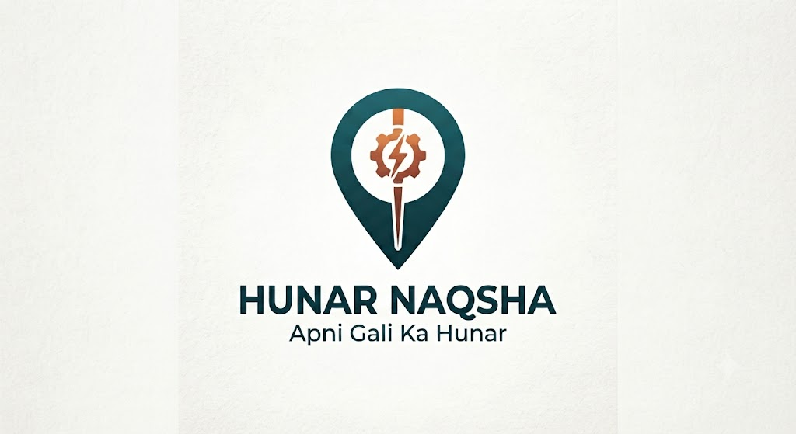

# Hunar Naqsha 🗺️✨
**Apni gali ka hunar, apni marzi ka daam.**
*(Your neighborhood’s skill, your own price)*

A mobile-first community skill marketplace with AI-powered gap detection, AI price estimations, and localized bidding, built for the **Mohalla Mind** track at GDG AI Seekho Builders Day 2026.



---

## 🏆 The Problem
Pakistan has over **12 million home-based gig workers** (tailors, bakers, tutors) who rely entirely on word-of-mouth. If a resident in G-10 needs a tailor before Eid, they ask around on WhatsApp, often overpaying or failing to find nearby help. Meanwhile, a skilled tailor just one street over has no work because they lack a digital storefront.

## 💡 Our Solution
**Hunar Naqsha** makes the invisible mohalla economy visible. 
1. **Hyperlocal Bidding:** Residents post a need in their zone (e.g., G-10). Workers see nearby jobs and bid with their own prices and timelines.
2. **Community Trust:** Post-job feedback builds a public trust score (stars + completed jobs) for informal workers.
3. **AI Gap Detection:** We integrated an **AI Agent (GPT-4o-mini)** that fuses local demand, worker supply, bid response rates, and seasonal events (like Eid or exams) to predict skill shortages in specific zones before they become crises.
4. **AI Price Estimates:** Real-time budget suggestions generated by analyzing the task, zone, urgency, and seasonal demand multipliers to help users set fair expectations.
5. **Re-hire Shortcuts:** Easily manage and re-book past reliable workers with dedicated 1-click workflows.

---

## 🏗️ Architecture

You can view our complete system architecture diagram here:
👉 [Visual Architecture Diagram](docs/architecture.md)

---

## 🤖 How We Used AI (Mohalla Mind Track)
We built a robust **GapJudge Agent** using **GPT-4o-mini** (with algorithmic fallbacks) that fulfills all track requirements:
1. **Fuse Signals:** Fuses open needs, registered workers, bid silence, and season calendars.
2. **Reasoning:** It doesn't just summarize; it judges if a shortage is forming.
3. **Real Action:** It drafts bilingual WhatsApp mobilization notices.
4. **Show Impact:** The Home Dashboard zone tiles dynamically change colors (Green/Yellow/Red) based on the AI's judgment.
5. **Explain Why:** Every AI alert includes a 2-3 sentence reasoning card explaining *why* the gap exists.

We also integrated a **Price Estimation Agent** that gives residents instant real-time market value suggestions based on hyperlocal and temporal factors.

---

## 🚀 Quick Start (Run Locally)

### Prerequisites
- Node.js (v18+)
- (For APK Build): Android Studio / Java JDK 17

### 1. Start the API (Terminal 1)
```bash
cd server
npm install
npm run dev
```
*(Note: This automatically seeds the SQLite DB on first boot)*

### 2. Start the Frontend (Terminal 2)
```bash
cd client
npm install
npm run dev -- --port 4000
```

**Access the app:** `http://localhost:4000`

---

## 🔐 Demo Accounts
*We built this demo without complex auth to focus on the core marketplace flow.*

| Role | Name | Notes |
|------|-------|----------|
| **Resident** | Fatima | Can post needs, accept bids, and chat. |
| **Worker** | Ustaad Aisha | Can view local jobs, submit bids, and get rated. |

*(The dashboard automatically adapts based on the user's role.)*

---

## 🛠️ Tech Stack
- **Frontend:** React, Vite, Tailwind CSS, Lucide Icons (Mobile-First UI, Responsive Design)
- **Backend:** Node.js, Express, SQLite
- **AI / Agent:** OpenAI GPT-4o-mini (Fetch API) + Heuristic Fallback Pipeline
- **Deployment:** Capacitor for Android APK generation (Java 21 support)

---
*Built with ❤️ in Islamabad by Saadia-Asghar's Team for the GDG AI Seekho Builders Day Hackathon.*
