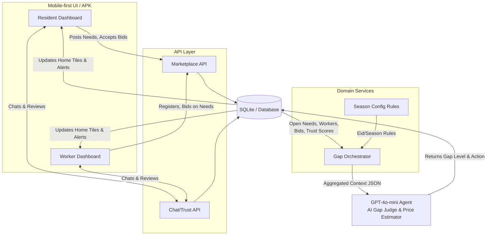

# Hunar Naqsha: System Architecture

```mermaid
graph TD
    %% User Interfaces
    subgraph Client [Mobile-first UI / APK]
        R[Resident Dashboard]
        W[Worker Dashboard]
    end

    %% API Layer
    subgraph API [API Layer]
        M[Marketplace API]
        C[Chat/Trust API]
    end

    %% Services
    subgraph Logic [Domain Services]
        GS[Gap Orchestrator]
        SS[Season Config Rules]
    end

    %% Artificial Intelligence
    AI[GPT-4o-mini Agent<br>AI Gap Judge & Price Estimator]

    %% Data
    DB[(SQLite / Database)]

    %% Connections
    R -->|Posts Needs, Accepts Bids| M
    W -->|Registers, Bids on Needs| M
    R <-->|Chats & Reviews| C
    W <-->|Chats & Reviews| C

    M --> DB
    C --> DB

    DB -->|Open Needs, Workers,<br>Bids, Trust Scores| GS
    SS -->|Eid/Season Rules| GS
    GS -->|Aggregated Context JSON| AI
    AI -->|Returns Gap Level & Action| DB
    
    DB -->|Updates Home Tiles & Alerts| R
    DB -->|Updates Home Tiles & Alerts| W
```
